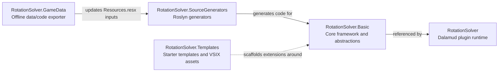

# RotationSolverReborn Project Structure Map

## Overview

RotationSolverReborn is organized around a runtime plugin project, a shared rotation framework, Roslyn source generators, an offline data-generation tool, and template assets for new rotations.



## Solution Layout

```text
RotationSolverReborn/
|-- RotationSolver.sln
|-- README.md
|-- manifest.json
|-- Directory.Build.props
|-- BannedSymbols.txt
|-- ActionToggleList.md
|-- Images/
|-- Resources/
|   |-- AutoStatusOrder.json
|   |-- BeneficialPositions.json
|   |-- DancePartnerPriority.json
|   |-- DangerousStatus.json
|   |-- HostileCasting*.json
|   |-- IncompatiblePlugins.json
|   |-- InvincibleStatus.json
|   |-- KardiaTankPriority.json
|   |-- No*.json
|   |-- PriorityStatus.json
|   `-- RotationSolverRecord.json
|-- RotationSolver/
|   |-- RotationSolverPlugin.cs
|   |-- RotationSolver.json
|   |-- Extensions.cs
|   |-- Watcher.cs
|   |-- ActionTimeline/
|   |-- Commands/
|   |-- Data/
|   |-- ExtraRotations/
|   |   |-- Healer/
|   |   |-- Magical/
|   |   |-- Melee/
|   |   |-- Ranged/
|   |   `-- Tank/
|   |-- Helpers/
|   |-- IPC/
|   |-- RebornRotations/
|   |   |-- Duty/
|   |   |-- Healer/
|   |   |-- Limited Jobs/
|   |   |-- Magical/
|   |   |-- Melee/
|   |   |-- PVPRotations/
|   |   |-- Ranged/
|   |   `-- Tank/
|   |-- TextureItems/
|   |-- UI/
|   `-- Updaters/
|-- RotationSolver.Basic/
|   |-- AssemblyInfo.cs
|   |-- DataCenter.cs
|   |-- IEnoughLevel.cs
|   |-- ITexture.cs
|   |-- Service.cs
|   |-- Actions/
|   |-- Attributes/
|   |-- Configuration/
|   |-- Data/
|   |-- Helpers/
|   |-- Rotations/
|   |-- Traits/
|   `-- Tweaks/
|-- RotationSolver.GameData/
|   |-- Program.cs
|   |-- Util.cs
|   `-- Getters/
|-- RotationSolver.SourceGenerators/
|   |-- ConditionBoolGenerator.cs
|   |-- JobChoiceConfigGenerator.cs
|   |-- JobConfigGenerator.cs
|   |-- StaticCodeGenerator.cs
|   |-- Util.cs
|   `-- Properties/
`-- RotationSolver.Templates/
    |-- RotationSolver.Templates.sln
    |-- RotationSolver.ItemTemplates/
    |-- RotationSolver.ProjectTemplate/
    |-- RotationSolver.VSIX/
    |-- Full Rotation.zip
    |-- Rotation Template.zip
    `-- Simple Rotation.zip
```

## Project Responsibilities

### 1. RotationSolver

The main Dalamud plugin project. This is the runtime entry point loaded by the game client.

- RotationSolverPlugin.cs: plugin bootstrap, window registration, IPC provider initialization, and lifecycle wiring.
- RotationSolver.json: Dalamud plugin manifest and metadata.
- Commands/: chat command handlers for toggles, state changes, and plugin control.
- UI/: ImGui windows such as control, cooldown, overlay, and configuration surfaces.
- RebornRotations/: concrete combat rotations grouped by role, PvE/PvP mode, and duty-specific content.
- ExtraRotations/: additional or alternate rotations kept outside the main default set.
- ActionTimeline/: action history visualization and timeline export logic.
- IPC/: integration endpoints for other plugins or tools.
- Updaters/: per-frame or periodic update orchestration.
- TextureItems/ and Data/: UI-facing assets and localized/static data definitions.

### 2. RotationSolver.Basic

The shared runtime framework for building rotations. This project contains the base abstractions used by the plugin and by custom rotation authors.

- Actions/: action wrappers, metadata, and executable action abstractions.
- Attributes/: attributes that annotate rotations, configs, actions, and generated surfaces.
- Configuration/: config models and rotation-specific settings infrastructure.
- Data/: shared enums, constants, status/action data, and runtime state carriers.
- Helpers/: shared utility logic used by both base and concrete rotations.
- Rotations/: base rotation classes, role/job scaffolding, and duty abstractions.
- Traits/: job trait metadata and helpers.
- Tweaks/: cross-cutting behavior adjustments.
- DataCenter.cs and Service.cs: central runtime state, services, command constants, and hooks.

### 3. RotationSolver.SourceGenerators

Roslyn source generators that reduce handwritten boilerplate in the core framework.

- JobConfigGenerator.cs: generates job configuration surfaces.
- JobChoiceConfigGenerator.cs: generates choice-based config helpers.
- ConditionBoolGenerator.cs: generates boolean condition accessors and related glue.
- StaticCodeGenerator.cs: emits broader static helper code from embedded inputs.
- Properties/: generator resources, including generated input data consumed by the generators.

### 4. RotationSolver.GameData

An offline utility that reads FFXIV game data and exports code/resource inputs used by the source generators and framework.

- Program.cs: loads Lumina data, locates the solution root, and writes generated resources.
- Getters/: extraction logic for actions, statuses, content types, NPC names, and rotation item data.
- Util.cs: shared formatting and generation helpers.

### 5. RotationSolver.Templates

Template assets for creating new rotations or packaged starter projects.

- RotationSolver.ItemTemplates/: file-level templates for a new rotation class.
- RotationSolver.ProjectTemplate/: project-level template with assembly metadata and starter structure.
- RotationSolver.VSIX/: packaging surface for Visual Studio template distribution.
- ZIP files: ready-to-import rotation starter packs.

## Key Content Buckets

### Resources

The Resources directory contains JSON-driven behavior tables and heuristics that are loaded by runtime systems.

- Priority and partner logic: AutoStatusOrder.json, DancePartnerPriority.json, KardiaTankPriority.json, TheBalancePriority.json, TheSpearPriority.json.
- Encounter safety rules: HostileCastingArea.json, HostileCastingKnockback.json, HostileCastingStop.json, HostileCastingTank.json.
- Status filters: DangerousStatus.json, InvincibleStatus.json, NoCastingStatus.json, PriorityStatus.json.
- Exclusion lists and compatibility rules: NoHostileNames.json, NoProvokeNames.json, IncompatiblePlugins.json.
- Encounter positioning data: BeneficialPositions.json.

### RebornRotations

This is the largest functional directory in the repository.

- Duty/: content-specific rotations for special encounters and side systems.
- Healer, Magical, Melee, Ranged, Tank/: standard PvE job rotations grouped by role.
- Limited Jobs/: special handling for jobs such as Blue Mage and Beastmaster-style content.
- PVPRotations/: PvP-specific variants separated from PvE logic.

### UI

The UI layer is split by window responsibility instead of feature flags.

- ControlWindow: main control panel and quick toggles.
- RotationConfigWindow: detailed configuration editing and plugin information.
- CooldownWindow: grouped cooldown display.
- ActionTimelineWindow: recent GCD/oGCD action visualization.
- OverlayWindow and HighlightTeachingMode/: on-screen teaching and hotbar highlighting.

## Recommended Reading Order

If you need to understand the codebase quickly, start here:

1. RotationSolver/RotationSolverPlugin.cs
2. RotationSolver.Basic/Service.cs
3. RotationSolver.Basic/DataCenter.cs
4. RotationSolver.Basic/Rotations/
5. RotationSolver/RebornRotations/
6. RotationSolver/UI/
7. RotationSolver.GameData/Program.cs
8. RotationSolver.SourceGenerators/

## Practical Mental Model

The repository can be understood as a pipeline:

1. RotationSolver.GameData extracts and formats raw game data.
2. RotationSolver.SourceGenerators turns that data into strongly-typed generated code.
3. RotationSolver.Basic exposes the reusable rotation framework and abstractions.
4. RotationSolver implements plugin runtime behavior, UI, commands, and concrete rotations.
5. RotationSolver.Templates helps external authors build on the same framework.